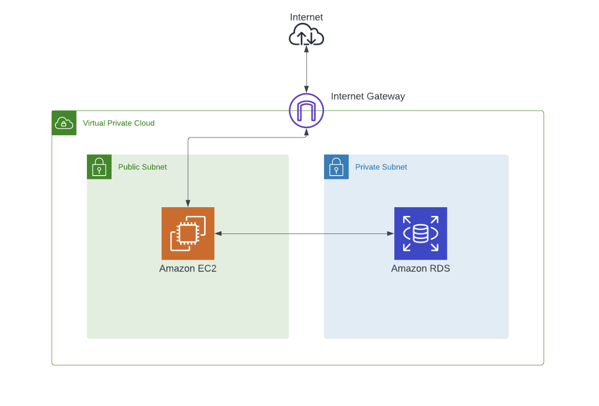

## Overview:

In this project, I've deployed a web server within an AWS VPC on an EC2 instance and set up interaction with an RDS database. By correctly handling POST and GET requests, the application demonstrated proficiency in storing and retrieving product dat.

It emphasized on the practical implementation of VPC, RDS, and REST APIs, enabling a deeper understanding of these AWS services.

## Architecture:

Built a web server in JavaScript deployed on an EC2 instance behind a Virtual Private Cloud (VPC).

### What public-facing EC2 does?

  **Accepts POST requests to `/store-products`**

-   Receives and parses a JSON body.
-   Connects to an AWS RDS database server on a private subnet within the VPC.
-   Inserts records into the `products` table in the database based on the JSON body's `products` array.
-   Returns status 200 for success or the appropriate HTML status code for errors or invalid inputs.

**Supports GET requests to `/list-products`**

-   Connects to the AWS RDS database within the private subnet.
-   Queries the `products` table and returns a list of all products with status 200.

**Database Schema**

Used an AWS RDS database Aurora.
The `products` table in the database should include fields: `name`, `price`, and `availability`